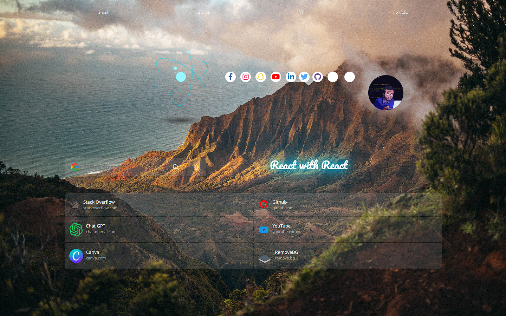
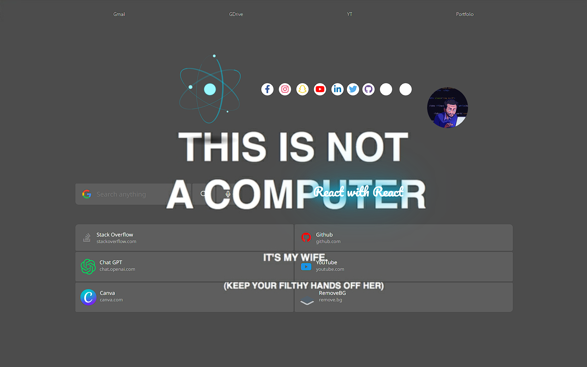
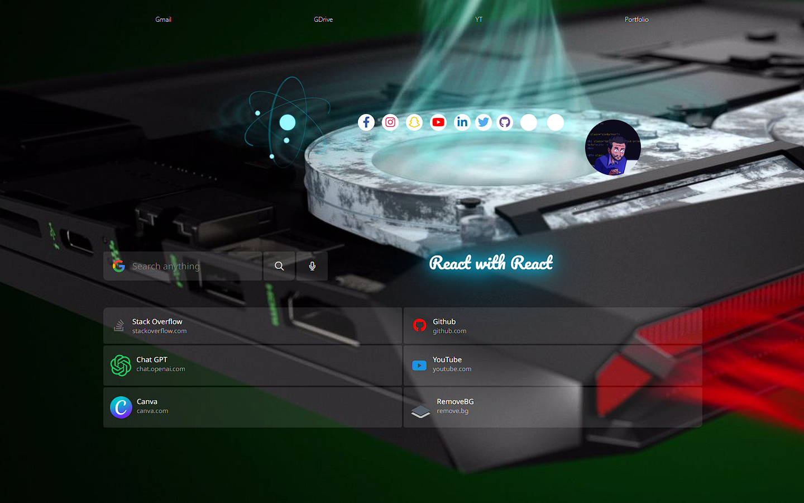
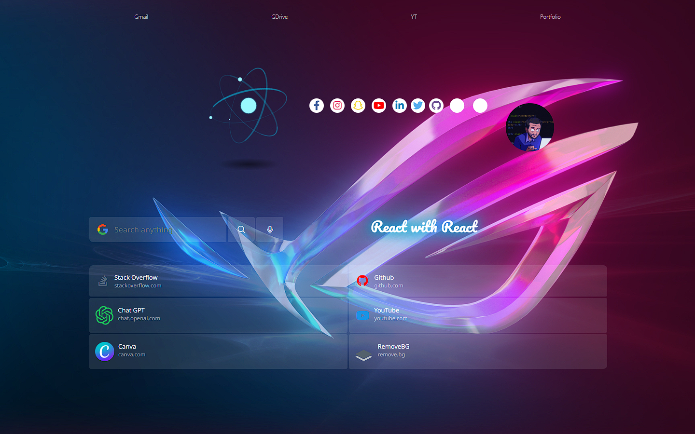
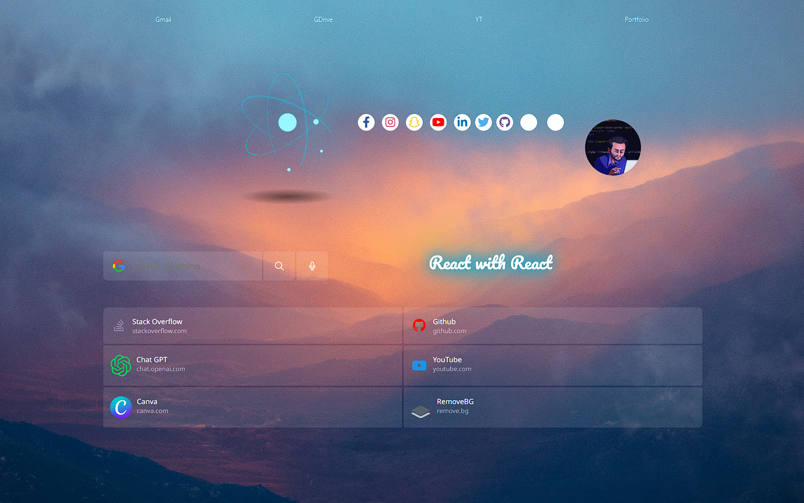

 # Codder-Browser

This is a creative and coding-inspired homepage for making the browser's new tab screen more interesting. It features high-quality HD backgrounds including minimal, clean, dark, coding live, etc type images.

## Demo

You can see a live demo of the project here:
- Backend: https://gpt-1260.onrender.com/
- Frontend: https://gpt-1260.vercel.app/ OR [gpt-1260-git-main-virus1260.vercel.app](https://gpt-1260-git-main-virus1260.vercel.app/) OR [gpt-1260-jadu7vixm-virus1260.vercel.app](https://gpt-1260-jadu7vixm-virus1260.vercel.app/)

## Getting Started

To activate this homepage, follow these steps in your browser:

1. Open Chrome Settings
2. Click on "On startup"
3. Select "Open a specific page or set of pages"
4. Add the URL of this homepage: [url]

Alternatively, you can clone this repository locally and use it, and add the local file address on your PC.

## Features

This homepage has the following features:

- Auto-refreshing background image changing
- Minimalistic and clean design
- Coding-inspired backgrounds

## Preview

## License

This project is licensed under the [MIT License](LICENSE).

